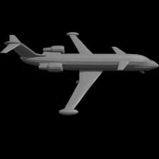

# Multiview Renderer

Simple blender script for rendering shaded images such as used by [MVCNN](https://arxiv.org/abs/1505.00880).



## Getting Started
- install requirements, preferably in a virtual env
```python
pip install -r requirements.txt
```
- set path to [blender2.79b](https://download.blender.org/release/Blender2.79/) executable in ``settings.py``
- set mesh dataset path in ``settings.py``
## Pre-process Meshes
- convert to .obj format
- normalize
- rotate/flip
```python
python preprocess_meshes.py
```

## Render Views
- render views from a sphere around the object
```python
python render_meshes.py
```

## Links
- MVCNN   https://github.com/jongchyisu/mvcnn_pytorch
- Blender Code https://github.com/weiaicunzai/blender_shapenet_render
